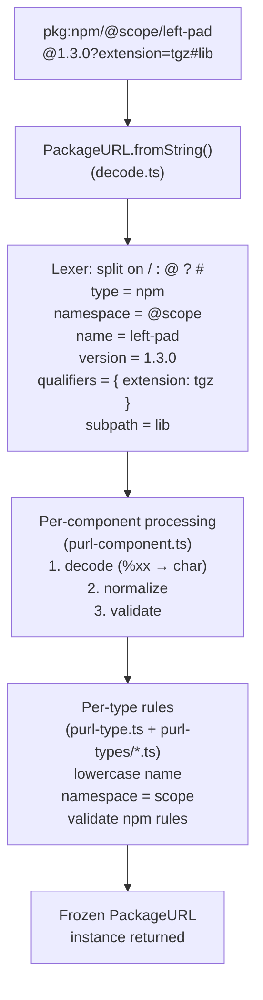
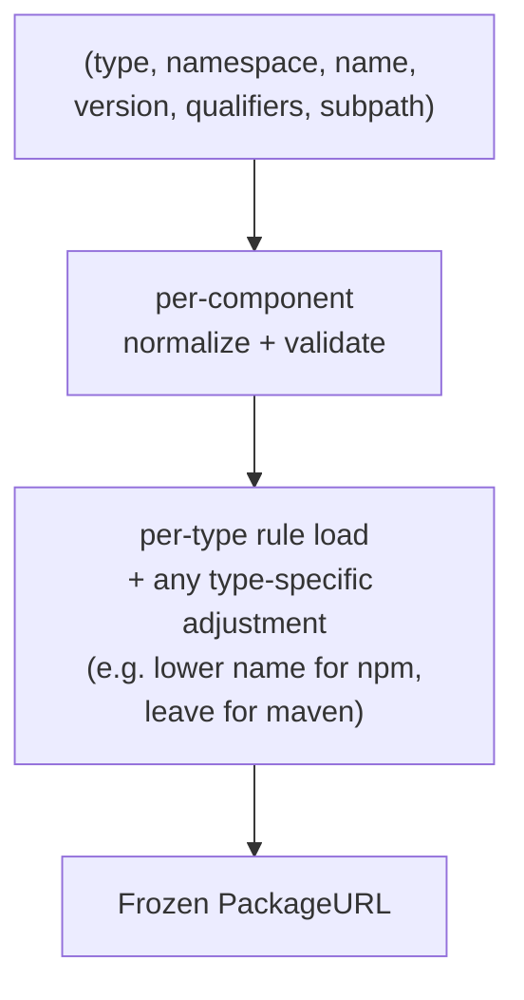

# Architecture

A map of how `@socketregistry/packageurl-js` is organized, which
module does what, and how data flows through a typical parse or
build. Read this before touching anything under `src/` for the first
time.

## Who this is for

New contributors who want to understand the library's internals
before making a change. No prior knowledge of the PURL spec
required; this doc introduces concepts as it goes.

## What a PURL is

> **PURL** (Package URL) is a specification for identifying any
> software package uniquely and deterministically across ecosystems.

The canonical form:

```
pkg:type/namespace/name@version?qualifier=value#subpath
```

Each piece is optional except `type` and `name`. Two concrete
examples:

```
pkg:npm/left-pad@1.3.0
pkg:pypi/requests@2.31.0?extension=tar.gz#src/urllib3
```

The spec lives at [package-url/purl-spec](https://github.com/package-url/purl-spec)
and is on its way to becoming **ECMA-427**. The library implements
the latest published spec + all accepted amendments.

## The module map

```
src/
├── index.ts                     ← public API surface (re-exports)
│
├── package-url.ts               ← PackageURL class (main entry point)
├── package-url-builder.ts       ← PurlBuilder (fluent alternative)
│
├── decode.ts                    ← string → fields
├── encode.ts                    ← fields → string (serialization)
├── stringify.ts                 ← canonical pkg:... rebuild
├── normalize.ts                 ← lowercase, trim, nudge to canonical
├── validate.ts                  ← shape + format checks
│
├── purl-component.ts            ← PurlComponent: normalize/encode/validate
├── purl-type.ts                 ← PurlType: per-ecosystem rule loader
├── purl-qualifier-names.ts      ← known qualifier keys (checksum, vcs_url, etc.)
│
├── result.ts                    ← Result<T, E> + Ok/Err helpers
├── error.ts                     ← PurlError + PurlInjectionError
│
├── url-converter.ts             ← URL ↔ PURL conversion (~25 ecosystems)
├── compare.ts                   ← equal, matches (wildcard, ReDoS-safe)
├── exists.ts / purl-exists.ts   ← registry existence checks (npmExists, etc.)
├── vers.ts                      ← version-range specifiers (pre-standard)
│
├── constants.ts                 ← KNOWN_TYPES, KNOWN_COMPONENTS, etc.
├── helpers.ts                   ← small internal utilities
├── lang.ts                      ← Error message strings (i18n-ready)
├── objects.ts                   ← safe-freeze, null-prototype utilities
├── strings.ts                   ← injection-character detection
├── primordials.ts               ← cached JS built-ins (Map, Set, Array.from)
│
└── purl-types/                  ← 41 ecosystem handlers
    ├── alpm.ts         apk.ts          bazel.ts        bitbucket.ts
    ├── bitnami.ts      cargo.ts        cocoapods.ts    composer.ts
    ├── conan.ts        conda.ts        cpan.ts         cran.ts
    ├── deb.ts          docker.ts       gem.ts          generic.ts
    ├── github.ts       gitlab.ts       golang.ts       hackage.ts
    ├── hex.ts          huggingface.ts  julia.ts        luarocks.ts
    ├── maven.ts        mlflow.ts       npm.ts          nuget.ts
    ├── oci.ts          opam.ts         otp.ts          pub.ts
    ├── pypi.ts         qpkg.ts         rpm.ts          socket.ts
    ├── swid.ts         swift.ts        unknown.ts      vscode-extension.ts
    └── yocto.ts
```

## Data flow — parsing a PURL string



Parsing throws `PurlError` on malformed input (missing required
pieces, invalid percent-encoding, rule violations). Valid PURLs
never throw; the result is a frozen instance with every field
normalized to its canonical form.

## Data flow — building a PURL from scratch

Two entry points:

**Constructor** (all-at-once):

```typescript
new PackageURL(
  'npm',
  '@scope',
  'left-pad',
  '1.3.0',
  { extension: 'tgz' },
  'lib',
)
```

**Builder** (fluent):

```typescript
PackageURL.builder()
  .type('npm')
  .namespace('@scope')
  .name('left-pad')
  .version('1.3.0')
  .qualifier('extension', 'tgz')
  .subpath('lib')
  .build()
```

Both paths converge:



## Core abstractions

### `PackageURL` — the main class

Instances are **immutable**. You cannot mutate `.name` after
construction; you build a new instance (builder or constructor) to
represent a change.

Immutability prevents a whole class of bugs: once a PURL is in a
data structure (like a dependency graph), consumers can trust it
will not change under them. Freezing is enforced via
`Object.freeze` in the constructor.

Methods on an instance:

- `.toString()` — canonical serialization (calls `stringify.ts`)
- `.toJSON()` — plain object for `JSON.stringify()`
- `.toObject()` — alias for `toJSON`

There is no `.clone()` method because instances are already
immutable — aliasing is safe.

### `PurlBuilder` — the fluent alternative

Use when you are constructing a PURL from computed values and want
to validate each piece as you go:

```typescript
const builder = PackageURL.builder().type('npm')

for (const dep of manifest.dependencies) {
  if (dep.startsWith('@')) {
    builder.namespace(dep.split('/')[0]).name(dep.split('/')[1])
  } else {
    builder.name(dep)
  }
}

const purl = builder.build()
```

See `docs/builders.md` for the full API.

### `PurlComponent` — per-field policy

A `PurlComponent` is the triple `(normalize, encode, validate)`
applied to a field like `name` or `namespace`. Lives in
`src/purl-component.ts`. Example: the `name` component's normalize
step lowercases for some types, preserves case for others.

### `PurlType` — per-ecosystem rule bundle

A `PurlType` is the rule-set for one ecosystem (`npm`, `maven`,
`pypi`, …). Each file under `src/purl-types/` exports a type object
with fields like:

```typescript
export const npm: PurlType = {
  normalize: { name: lowercaseName, namespace: lowercaseNamespace },
  validate: { ... },
  rules: { ... },
  // metadata
  defaultRegistry: 'https://registry.npmjs.org',
}
```

See `docs/converters.md` for how each ecosystem handles URL
conversion, and `src/purl-types/README.md` (TODO) for a rule
template.

### `Result<T, E>` — functional error handling

The library supports two error-handling styles:

1. **Throwing** — the default on `new PackageURL(str)`. Convenient
   for code that can afford to catch at a boundary.
2. **Result** — `PackageURL.fromStringResult(str)` returns a
   `Result<PackageURL, PurlError>` that is `Ok(purl)` on success or
   `Err(err)` on failure. Convenient for validation pipelines where
   you want every failure aggregated, not the first one.

`Result` lives in `src/result.ts` with `Ok`, `Err`, `ResultUtils`
helpers:

```typescript
const results = candidates.map(c => PackageURL.fromStringResult(c))
const valid = results.filter(r => r.ok).map(r => r.value)
const errors = results.filter(r => !r.ok).map(r => r.error)
```

### `PurlError` + `PurlInjectionError`

Two error classes:

- **`PurlError`** — spec-level rule violation. Message shape is
  lowercase, no trailing period, follows
  `{type} "{component}" component {violation}`.
- **`PurlInjectionError`** — the input contained a dangerous
  control character that could desync a downstream consumer (URL
  encoder, shell interpolation, SQL). Thrown before parse — we
  refuse to even _interpret_ input that could smuggle injection
  payloads.

See `docs/safety.md` for the threat model.

## Dependency direction

```
            index.ts  (public API)
                │
                ▼
          ┌───────────┐
          │ PackageURL │─────────────┐
          └─────┬──────┘             │
                │                    │
                ▼                    ▼
         ┌──────────┐         ┌─────────────┐
         │ decode   │         │ PurlBuilder │
         └───┬──────┘         └─────┬───────┘
             │                      │
             └────┬────────┬────────┘
                  │        │
                  ▼        ▼
          ┌──────────┐  ┌──────────────┐
          │ validate │  │ purl-type    │───▶ purl-types/*.ts
          └────┬─────┘  └──────┬───────┘
               │               │
               ▼               ▼
        ┌──────────────┐  ┌──────────────┐
        │ encode       │  │ normalize    │
        └──────┬───────┘  └──────┬───────┘
               │                 │
               ▼                 ▼
        ┌──────────────┐  ┌──────────────┐
        │ strings      │  │ objects      │
        │ (injection)  │  │ (freeze)     │
        └──────────────┘  └──────────────┘
```

No cycles. `index.ts` only depends on top-level symbols;
`purl-types/*.ts` depends on the abstractions (`PurlComponent`,
`PurlType`) but not on `package-url.ts` itself. This lets you
add a new ecosystem without touching any existing file.

## How ecosystems plug in

Each file under `src/purl-types/` exports a single `PurlType`
object. Adding a new ecosystem:

1. Create `src/purl-types/<name>.ts` and export the rule object.
2. Register it in `src/purl-type.ts`'s `knownTypes` map.
3. Write functional tests at `test/purl-types/<name>.test.mts`.
4. Run `pnpm test` to validate.
5. Commit.

All existing ecosystem handlers are small (50–200 lines each).
They share a template — see `src/purl-types/npm.ts` as a baseline
for registry-style ecosystems or `src/purl-types/docker.ts` for
container-style.

## Compilation model

- **Source**: TypeScript under `src/`, strict mode.
- **Target**: CommonJS (Node 18+), one output file per module
  under `dist/`.
- **Type declarations**: emitted as `.d.ts` beside the JS.
- **Build tool**: esbuild transform (see `scripts/build.mts`).

We target CommonJS because the consumers in the Socket fleet are
still a mix of ESM and CJS. ESM-only consumers can `import` a
`.js` file without issue since Node auto-detects, but the dual
mode means we don't need `.mjs`/`.cjs` exports proliferation.

## Testing model

Vitest with two configs:

- **`.config/vitest.config.mts`** (threads, shared memory) —
  ~95% of tests. Fast, parallel.
- **`.config/vitest.config.isolated.mts`** (forks, full isolation)
  — tests that mock globals (via `vi.doMock`) or modify
  `process.env` / `process.chdir`. File naming:
  `*.isolated.test.mts`.

Test style in this repo: **functional**, not source-scanning.
Tests assert behavior (inputs → outputs) via the public API.
Tests never read source files and assert on contents.

Coverage: 100% required, enforced by CI.

See `docs/contributing.md` for the full workflow.

## Where to look

- **How do I parse a string?** → `src/decode.ts`
- **How do I serialize to canonical form?** →
  `src/stringify.ts` → `src/encode.ts`
- **Where does ecosystem X's rule live?** → `src/purl-types/<x>.ts`
- **How does URL-to-PURL conversion work?** →
  `src/url-converter.ts` (see `docs/converters.md`)
- **How does the `Result` pattern thread through?** →
  `src/result.ts`
- **Where are error messages defined?** → `src/lang.ts`
- **What makes a PURL "injection-safe"?** → `src/strings.ts`
  (see `docs/safety.md`)

## Further reading

- [`docs/builders.md`](./builders.md) — PurlBuilder fluent API
- [`docs/converters.md`](./converters.md) — URL ↔ PURL
- [`docs/safety.md`](./safety.md) — injection detection, freeze
- [`docs/vers.md`](./vers.md) — version-range specifiers
- [`docs/api.md`](./api.md) — complete API reference
- [`docs/types.md`](./types.md) — TypeScript type reference
- [`docs/tour.md`](./tour.md) — how the tour site is built
- [package-url/purl-spec](https://github.com/package-url/purl-spec) —
  the upstream spec
